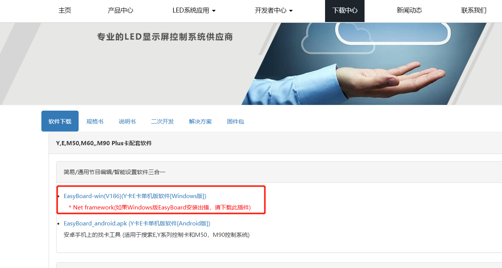
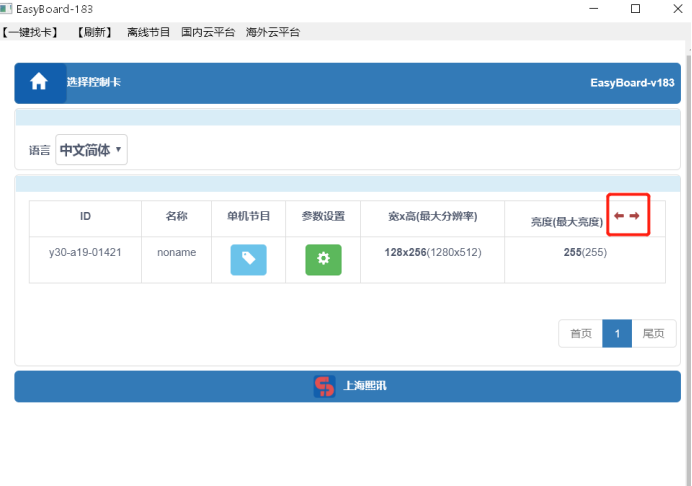
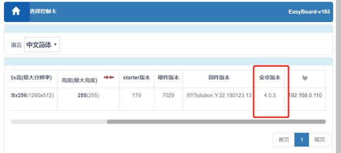
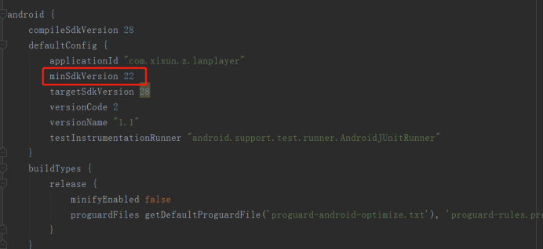
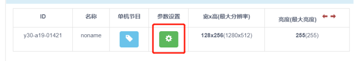
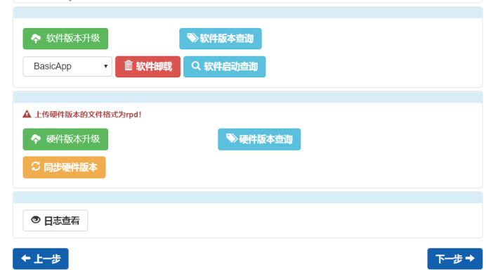

[TOC]

# Android APK Solution

## 1、Solution brief Introduction

Develop own APK is the most flexible way. Some functions need to use the interfaces of Cardsystem (pls check xixun_card_setting.zip )

Preparation：

- At least know one kind of android program language (JAVA、Kotlin、Scala,etc）
- Know basic knowledge of android（Activity，Service，BroadcastReceiver,etc）

## 2、Check led controller android version

### 2.1、download and install Easyboard

Please visit https://ledok.cn/download.html，download and install Easyboard.

### 2.2、Check led controller android version

run easyborad

click that arrow icon and then move to the right side, will find the android version of led controller.

### 2.3、Setup APK android compatible version

Run android development tool, find build.gradle file under project app directory, open this file

modify the lowest compatible version, following is the version table

| API level | ***\*initial Android version\**** | ***\*Linux kernel version\**** |
| --------- | --------------------------------- | ------------------------------ |
| 28        | 9                                 |                                |
| 27        | 8.1                               | 4.10                           |
| 26        | 8.0                               | 4.10                           |
| 25        | 7.1                               | 4.4.1                          |
| 24        | 7.0                               | 4.4.1                          |
| 23        | 6.0                               | 3.18.10                        |
| 22        | 5.1                               | 3.16.1                         |
| 21        | 5.0                               | 3.16.1                         |
| 20        | 4.4w                              | 3.10                           |
| 19        | 4.4                               | 3.10                           |
| 18        | 4.3                               | 3.4.0                          |
| 17        | 4.2                               | 3.4.0                          |
| 16        | 4.1                               | 3.0.31                         |
| 15        | 4.0.3                             | 3.0.1                          |
| 14        | 4.0                               | 3.0.1                          |
| 13        | 3.2                               | 2.6.36                         |
| 12        | 3.1                               | 2.6.36                         |
| 11        | 3.0                               | 2.6.36                         |

## 3、If need API provided by Sysolution, Please import xixun_card_setting.jar file

this file is in the same folder.

## 4、Install third party APK into Led controller

open Easyboard and click Parameter settings, password is 888

Enter "System version management"

Click "Update software" button, select the APK and wait for upgrade success. 