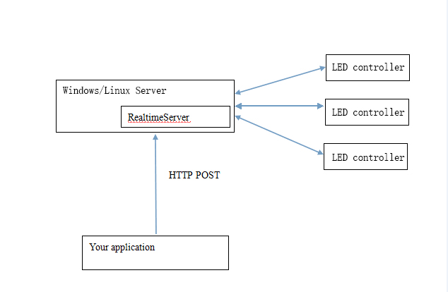
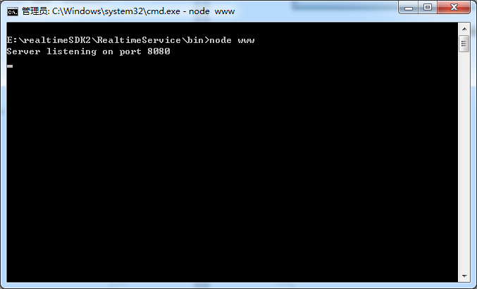
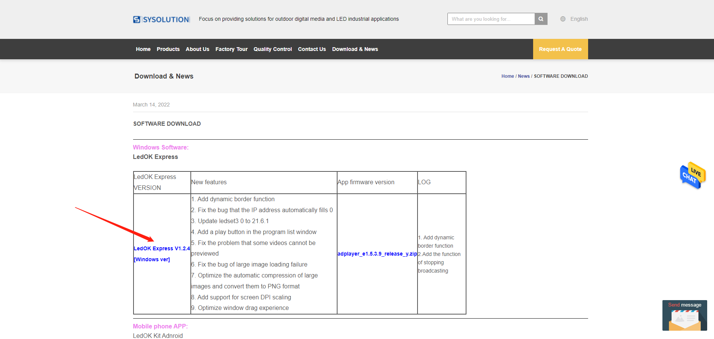
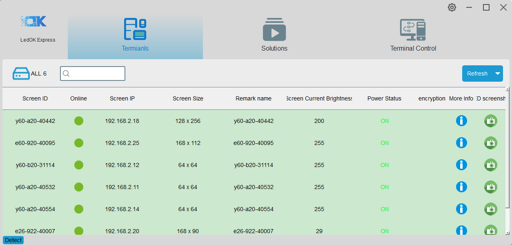
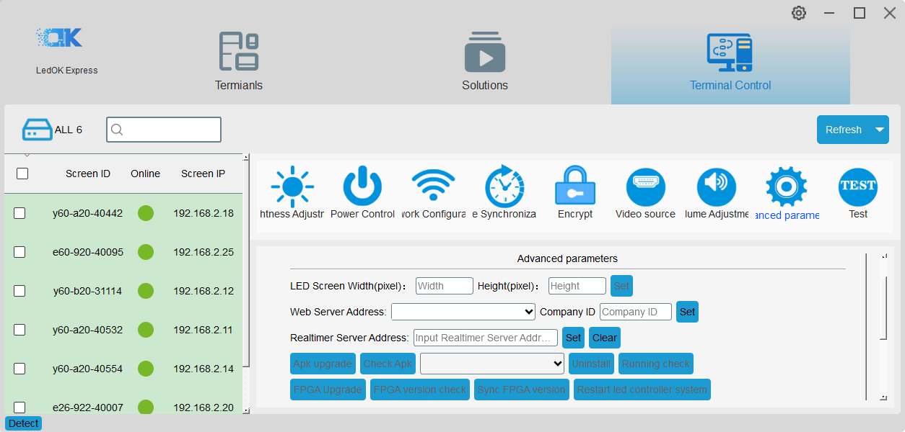
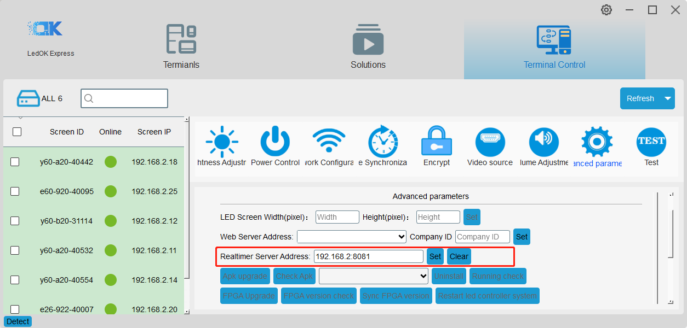
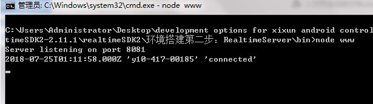

[TOC]

# 1、realtime solution brief introduction

Based on Sysolution Realtime SDK, using web technology and http communication (be good at JavaScript), this is a quick development solution although with limited functions. 

Necessary Preparation：

- Know html+css
- Be good at JavaScript
-  At least know one back-end develop language（C#, JAVA, PHP, nodejs,etc）

## 1.1、Realtime Diagram

# 2、Realtime server environment buildup

## 2.1、brief introduction

- This solution only workable for users who have knowledge of web technology, can visit any website by using loadUrl interface,Provide invokeJs to call javascript method in current webpage (can transfer text data via this method) to realize real time display, users can customize define display interface and logic.

> Principle:** controller connects to realtime Server software（this software running based on nodejs） through network, then users web system or other types software post specific format of data via http protocol to realtime Server then realize display in real time. 

## 2.2、Install nodejs

Install the correct nodejs according to the Server operation system, download link：*http://nodejs.org/download/* . The SDK contains the application for windows 64bit and 32bit system. 

## 2.3、Run realtimeServer

windows system：ress Shift key meanwhile right click “RealtimeServer” folder in SDK, then choose “Open command window here” and input node bin\www

## 2.4、Set server address for controller

Please visit https://ledok.cn/download.html and download Easyboard software

install Easyboard and run it, it will auto search all led controllers within the same Local area network.

please enter Parameter settings, password is 888 .Then go to “System network server configuration”. （System version management option is for install and uninstall software and etc）.

Input the Realtime server’s  host computer’s IP and port (8081 is default port) and SAVE.

When see tip message saying Good Job, means save success

when connection success, realtime server interface will show following information 

## 2.5、Modify realtime port

If want to modify monitor port for realtime server, please go to directory of realtimeServer and open config.js file by text editor then change 8081 into new port number and then set terminal restart notification. Please refer to explanation of restartNotification.