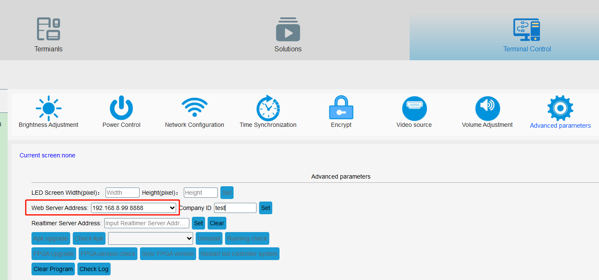

[TOC]

# WebSocket Solution

## 1、Get basic information and heartbeat

First, need to build up a websocket server to receive controller's basic information and heartbeat package. Second, set the websocket server address as controller's web server address via Easyboard. 

Example: if arrange the websocket server in192.168.8.99：8888, then please set the controller's web server address like the below image:

controller will send 3 pieces of data when connected to the websocket server: 

1、controller serial id（character string data，example：y10-618-01234）

2、Encrypted information binary data, customer can ignore this data

3、Authentication information binary data，customer can ignore this data

websocket server will send JSON character string to Led controller (client) after received those 3 pieces of data

{"_type":"GetCardInfo","id":"first"}

client will return JSON character string contains all basic information after received. 

4、Recommend to answer an empty data when websocket server received an empty data from Led controller, this will keep heartbeat, also can know if led controller keep online. 

 

 

GetCardInfo return information format, example：

{

  "_type":"CardInfo",

  "cardId":"y10-817-01926", //serial id

  "commandId":"first",

  "card":{

​    "alias":"noname",	//terminal alias

​    "updateVersion":"6.6",	//update version number

​    "sim":{					//SIM information

​      "deviceId":null,

​      "networkCountryIso":"",

​      "number":null,

​      "simCountryIso":"",

​      "simOperatorName":"",

​      "simSerialNumber":null,

​      "subscriberId":null,

​      "simState":0

​    },

​    "screenStatus":"on",		//screen status：on，off

​    "companyId":"test",		//company ID，can ignore

​    "connVersion":"9.8.4",	//conn version number

​    "playerVersion":"10.2.8",	//xixunplayer version number

​    "currentProgramId":null,	//current program id

​    "currentProgramName":null, //current program name

​    "netType":"ETH",	//network type：ETH，WLAN，other 3/4G

​    "ledsetVersion":"5.0.3.4", //cardsystem version number

​    "humidity":0,	//humidity

​    "lat":0,	//current GPS latitude

​    "diskSize":0, //not used

​    "lng":0,//current GPS longitude

​    "ledsetVersionCode":459, 

​    "locked":false, //

​    "height":512, //screen height

​    "connVersionCode":80, 

​    "playerVersionCode":328,

​    "rssi":-9999, 

​    "brightness":64, //screen brightness

​    "autoBrightness":false, // if adjust  screen brightness according to light sensor

​    "temperature":0, //temperature from current sensor

​    "asu":99,

​    "updateVersionCode":15,

​    "volume":12, //volume

​    "width":1280 //screen width

  }

} 

